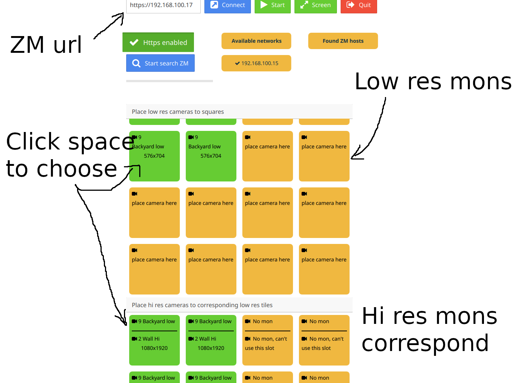
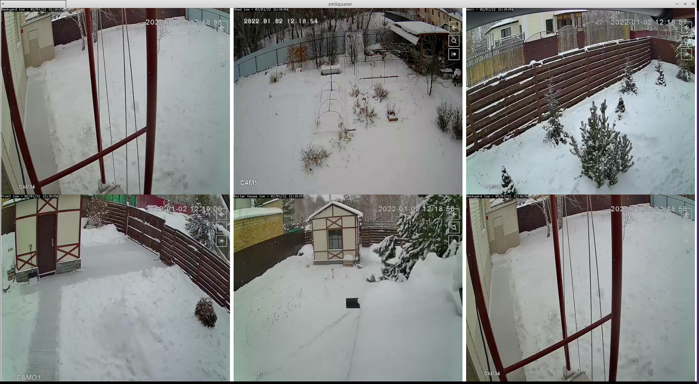

# zmSquarer TV version
Squarer with UI updated for usage on Android TV devices. Navigation is available by arrow keys. Select by space key on Windows/Linux, select key on Android.

# Binaries
* 
* 

### Screenshots

# zmSquarer (obsolete). Branch version_1.
Squarer for ZoneMinder.

### Limitations
For now ZM no-authentication supported only.

### The project goal
* Showing multiple cameras in one window like ZoneMinder montage page.
* Minimal CPU consuming. Decompressing MJPEG using libjpeg-turbo or Qt image.
* Convenient view capabilities. Build montage window. Link low res sources to hi res sources using color groups.

### Current state
MVP application for ZM on http/https(if OpenSSL is available) and no authorization.

### 3dparty source code used
* [Motion](https://github.com/Motion-Project/motion): an example of MJPEG parsing. Not in the build now.
* [LibJpeg-Turbo](https://github.com/libjpeg-turbo/libjpeg-turbo): decompress JPEG frames

### Build
Requirements:
* Qt 5.12 or higher.
* libjpeg-turbo. Set environment variable TJPEG_ROOT if you have libjpeg-turbo for faster jpeg decompression.
* Android build is available. For https support requires OpenSSL for Android https://github.com/KDAB/android_openssl.

The project file is zmSquarer.pro.

### Configuration/usage
* Insert ZoneMinder url and click connect to obtain configured cameras
* Use NewLine to add new horizontal lines
* The End marked uses to stop scene
* For multiple cameras scene use low resolution streams to save traffic
* Use groud identifier/color to connect low resolution stream on scene to hi resolution stream. If no connected hi resolution stream the same stream will be used for hi res view
* Double click opens menu. On Android double tap.

### Examples

