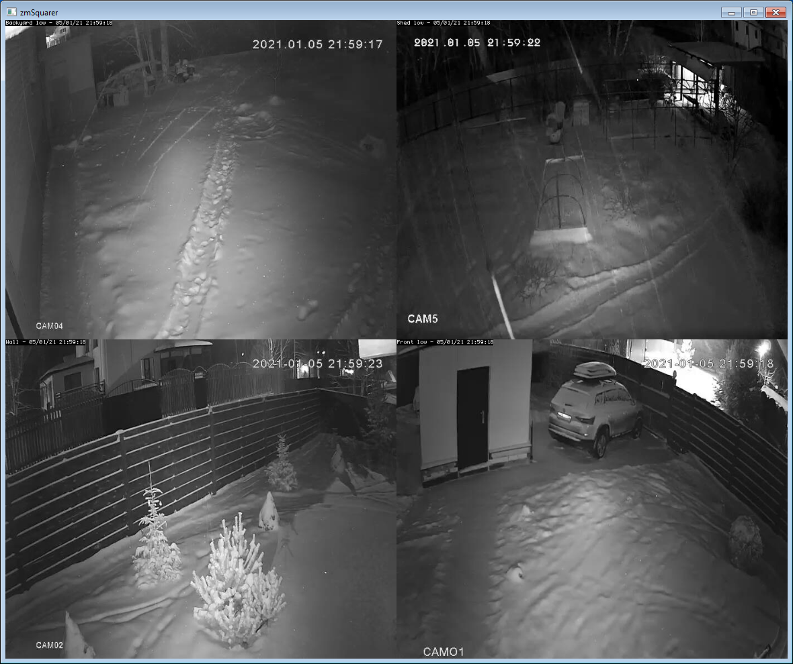

# zmSquarer
Squarer for ZoneMinder. 

### Limitations
Supports only http protocol for now and no-authentication.

### The project goal
* Showing multiple cameras in one window like ZoneMinder montage page.
* Minimal CPU consuming. Decompressing MJPEG using libjpeg-turbo or Qt image.
* Convenient view capabilities. Build montage window. Link low res sources to hi res sources using color groups.

### Current state
MVP application for ZM on http and no authorization.

### 3dparty source code used
* [Motion](https://github.com/Motion-Project/motion): an example of MJPEG parsing. Not in the build now.
* [LibJpeg-Turbo](https://github.com/libjpeg-turbo/libjpeg-turbo): decompress JPEG frames

### Build
Requirements:
* Qt 5.13 or higher
* libjpeg-turbo. Set environment variable TJPEG_ROOT. Or unset WITH_TURBOJPEG in camvideoproducer.cpp and remove libjpeg-turbo from pri files to build on Qt image decompressor.

The project file is zmSquarer.pro.

### Configuration/usage
* Insert ZoneMinder url and click connect to obtain configured cameras
* Use NewLine to add new horizontal lines
* The End marked uses to stop scene
* For multiple cameras scene use low resolution streams
* Use groud identifier/color to connect low resolution stream on scene to hi resolution stream. If no connected hi resolution stream the same stream will be used for hi res view
* Right mouse button click opens menu

### Examples

### Binaries
[Win x64](https://disk.yandex.ru/d/acwBnyuOkU72Lw)
